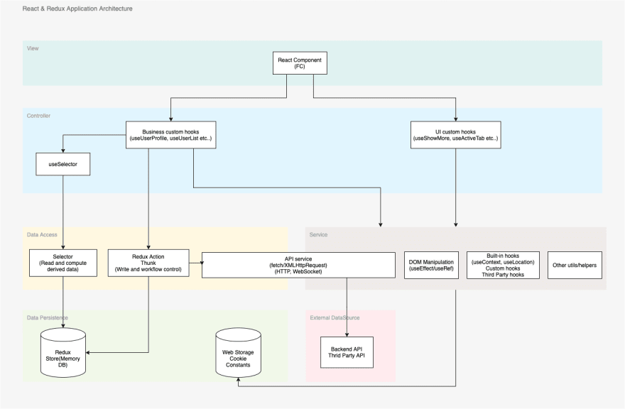

### 前言

> -   這本書是在講架構，為什麼講到範式？
>
> -   與架構的關聯？

回到 Ch1.

-   **架構**：從較宏觀的角度去看

    -   房子的樣貌，格局

-   **設計**： 從較微觀的角度看
    -   房子的燈，插座位置

舉個前端的例子：  
當收到一個 requirement....

React App Architecture:  


我們實際上在寫的：

```tsx
// React Functional Components
// What we really write.

export const App = () => {
	return <Component message="world!" />
}

export const Component = ({ message }) => {
	return <h1>Hello ${message}</h1>
}
```

```tsx
// Another Class components example

export default class App extends React.Component {
	constructor(props) {
		super(props)
		this.state = {
			// ...
		}
	}

	render() {
		return <Component message="world!" />
	}
}

export default class Component extends React.Component {
	constructor(props) {
		super(props)
		this.state = {
			// ...
		}
	}

	render() {
		return <h1>Hello ${this.props.message}</h1>
	}
}
```

-   範式所談論的是**_程式設計_**的方式，與語言無關。  
    例如 javascript 可以用 OOP，或是 FP 的方式來寫

-   架構與設計都是整個軟體(房子)的一部份

三種範式：

-   結構化程式設計(structured programming)
-   物件導向程式設計(object-orient programming)
-   函數式程式設計(functional programming)

> _架構的三大關注點： **函式**、**元件分離**、**資料管理**_  
> (原文為： function，應可解釋為**_功能_**)
