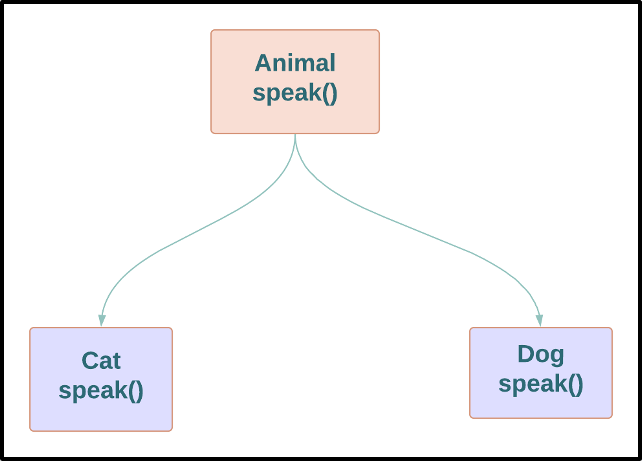

> _物件導向程式設計是透過**多型**，來獲得每個系統中的程式碼依賴方向有絕對控制力_

## 常見的物件導向的定義誤區

> _我認為他想說的：  
> 這些定義在 OO 裡面的確有出現(也很常見)，但是並不是讓他定義成為 OO 最主要的原因，在其他非ＯＯ的地方也能實作出來。_

-   資料和函式的結合？

    -   這意味著 object.function() 和 function(object) 有不一樣
    -   Dahl 與 Nygaard 將 function 呼叫堆疊框架一到了 heap，並發明了 OO

    ```ts
    // object.function()
    class Greeting {
    	constructor(message) {
    		this.message = message
    	}

    	hello() {
    		console.log(this.message)
    	}
    }

    const greeting = new Greeting('hello')
    greeting.hello()
    ```

    ```ts
    //  function(object)
    const messages = {
    	hello: 'hello',
    }

    function greeting(messages) {
    	const message = messages.hello
    	console.log(message)
    }

    greeting(messages)
    ```

-   一種模擬真實世界的方式？
    -   定義太過鬆散，還是沒有說明什麼是 OO
-   三種本質定義？：
    > _原文在這裡都是用 C 語言做舉例_
    -   封裝 (encapsulation)
    -   繼承 (inheritance)
    -   多型 (polymorphism)

## 封裝

> _在 C 語言中使用`structure` 反而可以將資料完美封裝，  
> 而到了 C++反而某種程度被破壞_

### C 語言:

> _point.h 的使用者可以呼叫`makePoint()`和`distance()`，
> **但是他們完全不知道 Point 的資料結構和 function 的實作**_

```c
// point.h
    struct Point;
    struct Point* makePoint(double x, double y);
```

```c
// point.c
// define the details

    #include "point.h"
    #include <stdlib.h>
    #include <math.h>

    struct Point {
        double x, y;
    }

    struct Point* makePoint(double x, double y) {
        //......
    }

    double distance(struct Point* p1, struct Point* p2) {
        // ...
    }
```

### C++ 語言：

> 因為編譯器在技術上需要查看這些在標頭檔裡的變數，  
> 所以 point.h 的使用者知道成員變數 x, y 的相關資訊，  
> 雖然在後續的`public`, `private`, `protected`等關鍵字修復  
> 但是這只是一種 hack 手法，在後續其他語言更弱化了封裝。

```cpp
// point.h
    class Point {
        public:
            Point(double x, double y);
            double distance(const Point & p) const;

        private:
            double x;
            double y;
    };

```

```cpp
// point.cc
    #include "point.h"
    #include <math.h>

    Point::Point(double x, double y): x(x), y(y) {}

    doublePoint::distance(const Point& p) const {
        //....
    }

```

## 繼承

> -   在 OO 語言之前就有了一種繼承(宣告一模一樣的資料結構，並延伸)，  
>     但是是使用一種欺騙的方式實作，不如真正的繼承使用方便。
> -   這種使用方式要實現多重繼承是非常困難的。
> -   OO 語言在繼承方面雖然沒有帶來新東西，但是使用上更方便。

### C 語言：

```c
// point.h
    struct Point;
    struct Point* makePoint(double x, double y);
```

```c
// namedPoint.h
    struct NamedPoint;

    struct NamedPoint* makeNamedPoint(double x, double y, char* name);

    void setName(struct NamedPoint* np, char* name);
    char* getName(struct NamedPoint* np);
```

-   在範例中，第二個程式的資料結構前兩個欄位的順序與上一個 Point 相同，  
    所以可以偽裝成 Point，因為 NamedPoint 是 Point 的一個純超集合，並維護對應成員順序。
-   在多重繼承的時候，就得不斷把成員往上加.....

```js
// point.ts
class Point {
	constructor(x: number, y: number) {
		this.x = x
		this.y = y
	}
}
```

```ts
// namedPoint.ts
import Point from 'path/to/point.ts'

class NamedPoint extends Point {
	constructor(name: string) {
		this.name = name
	}

	setName() {
		//...
	}
	getName() {
		//...
	}
}
```

## 多型

> [_多型指為不同資料類型的實體提供統一的介面。_][polymorphism-wiki]

-   在早期 C 語言必須用**函式指標**來實現多型的行為，這依賴一系列約定，
    工程師必須透過指標呼叫函示，如果有人沒遵守，產生的 bug 會很難追查和消除。
    所以指向函式的指標很是危險的。
-   雖然 OO 沒有帶來多型，但是使得多型更安全和方便。
-   作者認為最有威力和代表性。

### JS 範例:



```js
// Animal
// 介面
    abstract class Animal {
        public abstract speak();
    }

```

```js
// cat
    import Animal from 'path/to/animal.js'

    class Cat extends Animal {
        public speak() {
            console.log('Meow')
        }
    }
```

```js
// cat
    import Animal from 'path/to/animal.js'

    class Dog extends Animal {
        public speak() {
            console.log('Woof')
        }
    }
```

## 依賴反向

[polymorphism-wiki]: https://zh.wikipedia.org/zh-tw/%E5%A4%9A%E6%80%81_(%E8%AE%A1%E7%AE%97%E6%9C%BA%E7%A7%91%E5%AD%A6)
